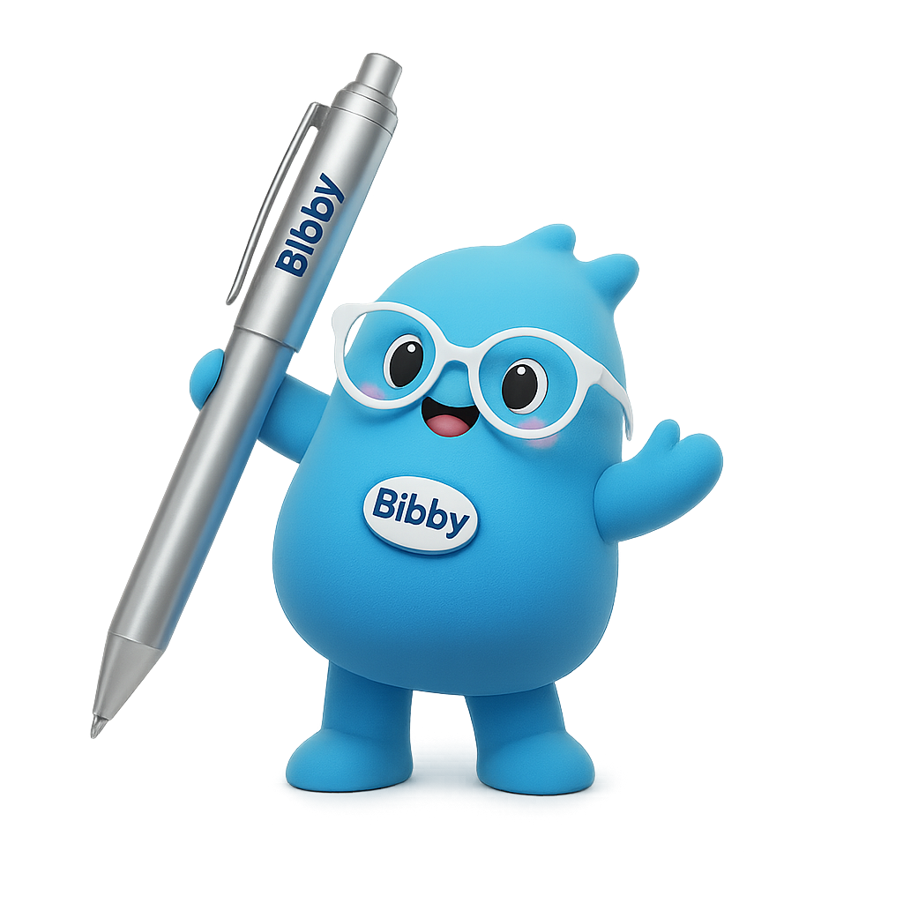

# Bibby AI

<div align="center">




# Bibby AI — LaTeXBench-500 Benchmark

### *The first open benchmark for AI-powered LaTeX compilation error detection & repair*

[](https://arxiv.org/abs/2602.16432)
[](https://opensource.org/licenses/MIT)
[](https://trybibby.com)
[](#institutional-adoption)

<br/>

**Bibby AI detects 91.4% of LaTeX errors before they silently break your paper.**  
*13 points ahead of OpenAI Prism. 30 points ahead of Overleaf.*

</div>

---

## 🖥️ The Editor

<div align="center">


*Bibby AI — AI-native LaTeX editor with real-time error detection, smart citation search, and live PDF preview. No plugins. No copy-paste. Everything in one place.*
</div>

---

## 📊 Benchmark Results (LaTeXBench-500)

LaTeXBench-500 is the **first standardised benchmark** for LaTeX compilation error detection and one-click repair, introduced in our [arXiv paper](https://arxiv.org/abs/2602.16432).

### Overall Performance

| Tool | Detection Accuracy (DA%) | Fix Accuracy (FA%) | Pre-compilation? |
|---|---|---|---|
| 🥇 **Bibby AI** | **91.4%** | **83.7%** | ✅ Yes |
| 🥈 OpenAI Prism | 78.3% | 64.1% | Partial |
| 🥉 Overleaf (native) | 61.2% | — *(no auto-fix)* | ❌ No |

### Per-Category Breakdown

| Error Category | Count | Bibby DA% | Prism DA% | Overleaf DA% |
|---|---|---|---|---|
| Undefined control sequences | 112 | 94.6% | 81.2% | 68.3% |
| Math mode errors | 98 | 92.8% | 79.4% | 63.1% |
| Table & figure errors | 86 | 90.1% | 77.9% | 59.4% |
| Reference errors | 79 | 91.2% | 78.8% | 61.7% |
| Package conflicts | 74 | 88.4% | 74.6% | 54.2% |
| Encoding & font errors | 51 | 87.3% | 72.1% | 52.8% |
| **Total / Average** | **500** | **91.4%** | **78.3%** | **61.2%** |

> **DA% = Detection Accuracy** — correct identification of error type AND location  
> **FA% = Fix Accuracy** — suggested fix produces clean, semantically correct compilation

---

## 🔬 What Is LaTeXBench-500?

500 authentic LaTeX compilation errors drawn from real-world arXiv preprints, across **6 error categories**, each with:
- Ground-truth error location (file + line number)
- Error category label
- Verified correct fix
- Compilation validation (before and after fix)

All errors were **silently failing** — i.e., the document compiled without crashing but produced incorrect output. This is the hardest and most practically relevant class of LaTeX errors.

---

## 🗂️ Repository Structure

```
bibby-latex-benchmark/
├── assets/
│   ├── bibby-mascot.png          ← Bibby mascot
│   └── bibby-editor-screenshot.png ← Editor UI
├── benchmark/
│   ├── corpus/                   ← 500 LaTeX documents
│   ├── ground_truth/             ← Annotated error locations
│   └── error_categories.md       ← Full taxonomy
├── evaluation/
│   ├── metrics.py                ← DA% and FA% calculation
│   ├── run_benchmark.py          ← Main runner
│   └── results/                  ← Raw results per tool
├── analysis/
│   ├── figures/                  ← All paper figures (reproducible)
│   └── notebooks/                ← Jupyter analysis notebooks
├── BENCHMARK.md                  ← How to run on a new tool
├── CONTRIBUTING.md
└── README.md
```

---

## 🚀 Run the Benchmark

### Prerequisites
```bash
pip install -r requirements.txt
# Requires: Python 3.10+, latexmk, biber
```

### Evaluate a tool
```bash
python evaluation/run_benchmark.py \
  --tool bibby \
  --corpus benchmark/corpus/ \
  --output evaluation/results/my_run/

# --tool options: bibby | prism | overleaf | custom
```

### Compute metrics
```bash
python evaluation/metrics.py \
  --results evaluation/results/my_run/ \
  --ground-truth benchmark/ground_truth/
```

### Reproduce paper figures
```bash
jupyter notebook analysis/notebooks/paper_figures.ipynb
```

---

## 🧠 Why Bibby AI Outperforms

Three architectural reasons Bibby AI's error detection is fundamentally different:

**1. AST-grounded localisation**  
Bibby maintains a live Abstract Syntax Tree of your document. When compiler logs point to line 847, Bibby traces back through the AST to find the *actual* source — which is often 20 lines earlier. Other tools trust the log line number blindly.

**2. Package-aware reasoning**  
Bibby's error model is conditioned on curated documentation for 2,000+ LaTeX packages. When `\pgfplotsset` fails, Bibby knows whether you're missing a `\usetikzlibrary` call vs. using a deprecated option — not just that something broke.

**3. Validated fix generation**  
Every suggested fix is compiled and validated before being shown to you. Bibby never surfaces a fix that doesn't actually work.

---

## 🏛️ Institutional Adoption

Bibby AI is used by researchers at:

| Institution | Use Case |
|---|---|
| **Simons Foundation** | Mathematical research papers |
| **Allen Institute** | Neuroscience & biology publications |
| **Yale University** | Academic dissertation writing |

---

## ✍️ Try Bibby AI

<div align="center">


**[→ Try Bibby AI free at trybibby.com](https://trybibby.com)**

No credit card. No installation. Open in your browser and start writing.

</div>

---

## 📚 Citation

If you use LaTeXBench-500 in your research, please cite:

```bibtex
@misc{jain2026bibby,
  title     = {Bibby AI — AI LaTeX Editor writing assistant for researchers 
               vs Overleaf Alternative vs OpenAI Prism},
  author    = {Jain, Nilesh and others},
  year      = {2026},
  eprint    = {2602.16432},
  archivePrefix = {arXiv},
  primaryClass  = {cs.DL},
  url       = {https://arxiv.org/abs/2602.16432}
}
```

---

## 🤝 Contributing

We welcome:
- **New tool evaluations** — run the benchmark on any tool and submit results via PR
- **Additional error categories** — open an issue to propose new LaTeX error types  
- **Corpus extensions** — more arXiv-derived documents with ground-truth annotations

See [CONTRIBUTING.md](CONTRIBUTING.md) for guidelines.

---

## 📄 License

Benchmark code & evaluation scripts: **MIT License**  
Corpus documents: Derived from arXiv papers under their respective CC licenses  
Paper: **CC BY 4.0**

---

<div align="center">

Made with 💙 by the Bibby AI team

[trybibby.com](https://trybibby.com) · [arXiv:2602.16432](https://arxiv.org/abs/2602.16432) · [@BibbyResearch](https://twitter.com/BibbyResearch)


</div>
